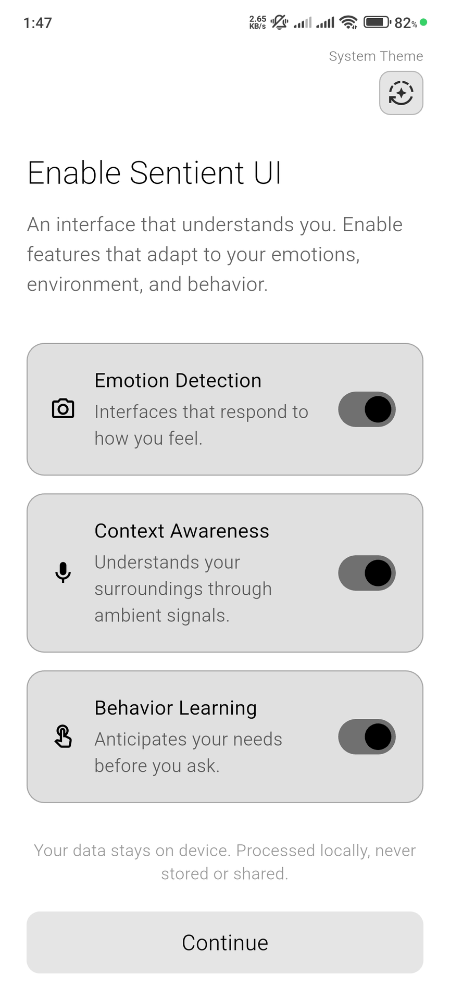

# Sentient UI Showcase

A complete demonstration application for the `sentient_ui` package. This app showcases how to integrate emotion-aware adaptation into a Flutter project.

<p align="center">
  
</p>

<p align="center">
  <em>Live demonstration of the Sentient UI framework in action</em>
</p>

---

## Features

- **SentientApp Integration**: Shows how to wrap your application to handle initialization and user consent automatically.
- **Adaptive Screens**: Separate demo screens for:
  - **Emotion Adaptation**: Watch the UI morph its theme and curves based on detected mood.
  - **Noise Adaptation**: Experience high-contrast overrides triggered by high ambient noise.
  - **System Overview**: Inspect the real-time data being processed by the Sentient Engine.
- **Simulator Drawer**: Use the interactive drawer to manually trigger emotional states and environmental conditions to see instant UI changes.

---

## Getting Started

### 1. Project Setup

This example depends on the local `sentient_ui` package. Ensure the paths are correct in `pubspec.yaml`:

```yaml
dependencies:
  sentient_ui:
    path: ../
```

### 2. Assets

To use the emotion detection features, the example app must declare the package assets in its own `pubspec.yaml`:

```yaml
flutter:
  assets:
    - packages/sentient_ui/assets/models/emotion_model.tflite
    - packages/sentient_ui/assets/models/emotion_labels.txt
```

### 3. Run the App

```bash
flutter pub get
flutter run
```

---

## Note on Privacy

This example demonstrates the built-in `SentientConsentView`. On the first run, the app will ask for permission to access camera and microphone data. This data is processed **entirely on-device** and is never uploaded to any server.